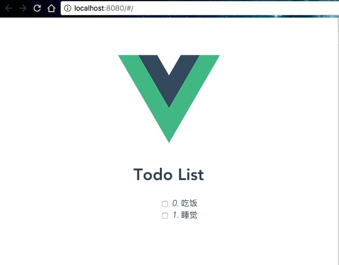
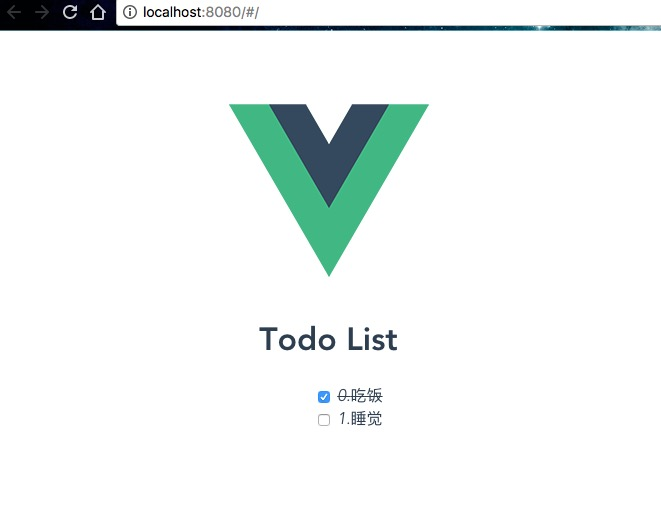

# 实现一个 TodoList - Vue2 Tutorials (二)

在了解了 Vue 的一些基本概念之后，就可以写一个最简单的小项目了 --- TodoList。麻雀虽小，五张俱全。虽然是一个小 demo，但也涉及到了组件化、双向绑定、自定义事件的触发与监听、计算属性等概念。接下来从这个小项目中，对这些基本概念进行实践，从而加深理解。

最终实现效果如下：


接下来就一一实现。

## 初始化项目

同样使用 `vue-cli` 初始化项目，直接回车就好了。

```shell
$ vue init webpack todoListDemo
$ cd todoListDemo
$ npm install
$ npm run dev
```

启动之后，浏览器就会自动现默认的页面。

在进行编码之前，首先要考虑组件怎么设计。在本文中，组件结构如下。


```js
+-----------------------+
|                       |
|  +-----------------+  |
|  |    Todo Add     |  |
|  +-----------------+  |
|  +-----------------+  |
|  |                 |  |
|  |   Todo List     |  |
|  |+---------------+|  |
|  ||   Todo Item   ||  |
|  |+---------------+|  |
|  |+---------------+|  |
|  ||   Todo Item   ||  |
|  |+---------------+|  |
|  |+---------------+|  |
|  ||   Todo Item   ||  |
|  |+---------------+|  |
|  |                 |  |
|  +-----------------+  |
|                       |
+-----------------------+
```

其中主要包括两个大的组件

- `TodoAdd` 添加 Todo 的一个输入框
- `TodoList` Todo 列表，里面有每一个 Todo Item

## 添加 TodoList 组件

在 `src/components` 目录下新建一个名为 `TodoList.vue` 的文件，并添加如下代码：

```html
<template>
  <div id="todoList">
    <h1>Todo List</h1>
    <ul class="todos">
      <li v-for="todo, index in todos" class="todo">
        <input
          type="checkbox"
          name=""
          value=""
          :checked="todo.isCompleted"
        >
        <span
          :class="todo.isCompleted ? 'completed' : ''"
          @
        >
          <em>{{ index + 1 }}.</em>{{ todo.text }}
        </span>
      </li>
    </ul>
  </div>
</template>
<script>
export default {
  name: 'TodoList',
  data: () => ({
    todos: [{
      text: '吃饭',
      isCompleted: false
    }, {
      text: '睡觉',
      isCompleted: false
    }]
  })
}
</script>
<style scoped>
#todoList {
  margin: 0 auto;
  max-width: 350px;
}
.todos li {
  list-style: none;
}
.todo {
  text-align: left;
  cursor: pointer;
}
.completed {
  text-decoration: line-through;
}
</style>
```


在 `TodoList` 中，使用 `todos` 数组来保存所有的 todo list。其中每一个 todo 都是对象，对象里面有两个属性，分别是 todo 的内容，和 todo 是否完成的标志。默认给数组添加了两个 todo，主要用于演示。

`src/components/Hello.vue` 在本项目中没什么用，可以随意删除。

然后修改 `src/router/index.js`：

```js
import Vue from 'vue'
import Router from 'vue-router'
import TodoList from '@/components/TodoList'

Vue.use(Router)

export default new Router({
  routes: [
    {
      path: '/',
      name: 'todoList',
      component: TodoList
    }
  ]
})
```

修改完之后，vue 会自动重新编译并刷新页面，这时浏览器的页面如下：



## 添加完成 Todo 的方法

在该 demo 中，当点击 todo item 或者前面的复选框的时候，就完成 todo。所以现在需要添加完成 todo 的方法，并设置 todo item 的点击事件。

像下面这样修改 `src/components/TodoList.vue` 中的 `template` 部分：

```html
<input
  type="checkbox"
  name=""
  value=""
  :checked="todo.isCompleted"
  @click="completed(index)"
>
<span
  :class="todo.isCompleted ? 'completed' : ''"
  @click="completed(index)"
>
  <em>{{ index }}.</em>{{ todo.text }}
</span>
```

然后在组件里面添加对应的 `completed` 方法：

```html
<script>
export default {
  // 其他现有代码
  name: 'TodoList',
  methods: {
    completed(index) {
      this.todos[index].isCompleted = !this.todos[index].isCompleted
    }
  }
}
</script>
```

当点击 `check box` 或 `span` 的时候，就调用 `completed` 方法并传入被点击的 todo item 的索引。在 `completed` 方法里面，更新数据对象 data 里面对应的 todo item 的 `isCompleted` 属性。这样就实现了完成 todo 和取消完成 todo 的功能。点击之后如图：



## TodoAdd 组件

接下来就需要完成添加新的 todo 的功能了。

新建一个文件 `src/components/TodoAdd.vue`，添加如下代码：

```html
<template>
  <div id="addTodo">
    <input
      type="text"
      name=""
      class="input"
      value=""
      v-model="todo"
      @keyup.enter="addTodo"
    >
    <button
      type="button"
      name="button"
      @click="addTodo"
    >
        添加
    </button>
  </div>
</template>
<script>
export default {
  name: 'addTodo',
  data: () => ({
    todo: ''
  }),
  methods: {
    addTodo () {
      if (this.todo) {
        this.$emit('add', this.todo)
        this.todo = ''
      } else {
        alert('内容不能为空')
      }
    }
  }
}
</script>
<style scoped>
.input {
  min-width: 200px;
}
</style>
```

首先在组件的数据对象 `data` 里面有一个 `todo` 属性，用来存储用户输入的内容。然后在 `template` 的 `input` 输入框里，使用 [`v-model`](https://cn.vuejs.org/v2/api/#v-model) 实现双向绑定。

当用户按下回车（`@keyup.enter="addTodo"`，详见 [键值修饰符](https://cn.vuejs.org/v2/guide/events.html#键值修饰符)）或者点击添加按钮（`@click="addTodo"`）的时候，就调用 `methods` 里面的 `addTodo` 方法。

`addTodo` 方法通过 [`vm.$emit`](https://cn.vuejs.org/v2/api/#vm-emit) 触发了一个 `add` 事件，并将用户输入的内容（即 `this.todo`）作为参数传递。事件触发之后，将输入框中的内容清空。

接下来就需要监听 `add` 事件了。监听事件需要在使用组件的模板里面，通过 `v-on` 来实现。详见 [使用-v-on-绑定自定义事件](https://cn.vuejs.org/v2/guide/components.html#使用-v-on-绑定自定义事件)。


## 完成添加 Todo 功能

在 `src/components/TodoList.vue` 中使用 `AddTodo` 这个子组件：

```html
<h1>Todo List</h1>
<!-- 调用子组件，并使用 v-on 监听 add 方法 -->
<!-- 当 add 事件触发时，就调用当前组件 addTodo 这个方法 -->
<todo-add v-on:add="addTodo"></todo-add>
<ul class="todos">
<!-- // 调用子组件 -->

<script>
  // 引入子组件
  import TodoAdd from './TodoAdd.vue'
  export default {
    name: 'TodoList',
    components: {
      TodoAdd
    },
    // ...
    methods: {
      // ...
      // 添加新的 todo
      addTodo() {
        this.todos.push({
          text: todo,
          isCompleted: false
        })
      }
    }
  }
</script>
```

到此，添加 todo 和完成 todo 功能就实现了。

## Todo 统计

接下来还可以做点别的事情，比如显示总共的 todo 数目，以及完成和未完成的数目。

要实现此功能，方法有很多种。最简单的一种是直接在模板中加入 JS 表达式，来显示总共的数目，比如：

```html
<p>总共有 <strong>{{ this.todos.lengt }}</strong> 个待办事项。</p>
```

对于简单的逻辑可以很方便用表达式写出来，但如果是比较复杂的逻辑，比如统计未完成数目（当然这个也可以用一个表达式搞定），可能一个表达式看起来就不太清晰。这个时候就可以用[计算属性](https://cn.vuejs.org/v2/api/#computed)。

修改 `src/components/TodoList.vue`：

```html
<!-- // ... -->
<ul class="todos">
<!-- // ... -->
</ul>
<div>
  <p v-show="todos.length === 0">
    恭喜！所有的事情都已完成！
  </p>
  <p v-show="todos.length !== 0">
    共 <strong>{{ todos.length }}</strong> 个待办事项。{{ completedCounts }} 个已完成，{{ notCompletedCounts }} 个未完成。
  </p>
</div>


<script>
// ...
export default {
  name: 'TodoList',
  // ...
  computed: {
    completedCounts () {
      return this.todos.filter(item => item.isCompleted).length
    },
    notCompletedCounts () {
      return this.todos.filter(item => !item.isCompleted).length
    }
  }
}
</script>
```

上述代码中通过 `completedCounts` 和 `notCompletedCounts` 两个计算属性，来计算出已完成和未完成的 todo。虽然这两个表达式可以直接放在模板中，但表达式比较复杂，看起来也不是很清晰，所以很多时候就可以用计算属性来计算出一个最终值，然后在模板中使用。

## 总结

到此，基于 Vue 的 Todo List 就完成了。在该项目中，涉及到了组件化、双向绑定、自定义事件的触发与监听、计算属性等概念。而且最重要的不是完成这个 Todo List 的代码，而是从实现功能的过程中举一反三，通过简单的 demo 实现，去思考如何用 vue 开发一个更大更完整的项目。
